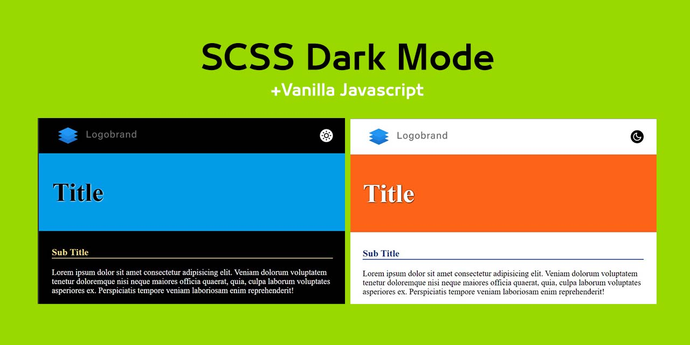

# scss theme with dark mod

## features
- Custom light colors & dark colors.
- Transparent Colors.
- automatic generate root variables.
- prefers-color-scheme automatic recognize system theme.
- color-scheme.
- color & background-color function & mixin.
- automatic generate var(--color) and fallback #hex-color.
- color-replace function to generate any color in any css properties.

